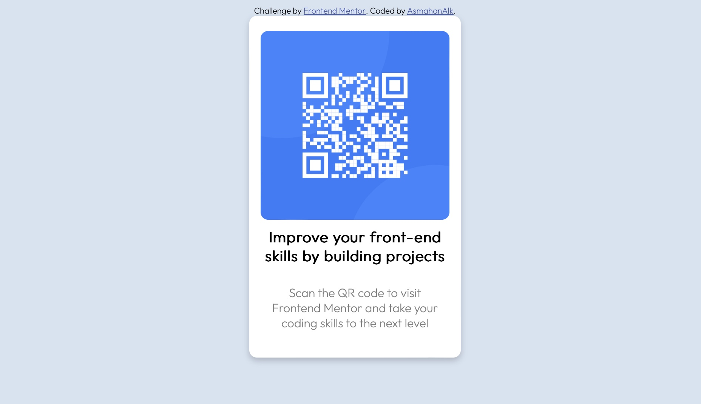

# Frontend Mentor - QR code component solution

This is a solution to the [QR code component challenge on Frontend Mentor](https://www.frontendmentor.io/challenges/qr-code-component-iux_sIO_H). Frontend Mentor challenges help you improve your coding skills by building realistic projects. 


**Note: Delete this note and update the table of contents based on what sections you keep.**

## Overview

### Screenshot




### Built with

- Semantic HTML5 markup
- CSS custom properties
- Flexbox
- CSS Grid
- Mobile-first workflow


### What I learned

I learned about the tricky process of knowing each thing when copying a picture. There is some stuff you miss ulimately. I could say I'm proud of the pre built set up of my text based tags in CSS such as;

CSS

```*{
    font-family: 'Outfit', sans-serif;
}


h2{
    font-family: 'Outfit', sans-serif;
    font-size: large;
    font-weight: 700;
}

p{
    font-family: 'Outfit', sans-serif;
    font-size: 15px;
    font-weight: 400;
}
```


### Continued development

I want to feel comfortable in how I set up my projects because they will be very important later on in building upon them. Almost like a sturdy bridge for when the cars start driving on them, it doesn't collapse. 


### Useful resources

I didn't use any sources. 

## Acknowledgments

I would love to give credit for someone if I did use someone else. Next time of course if I reach out for help

